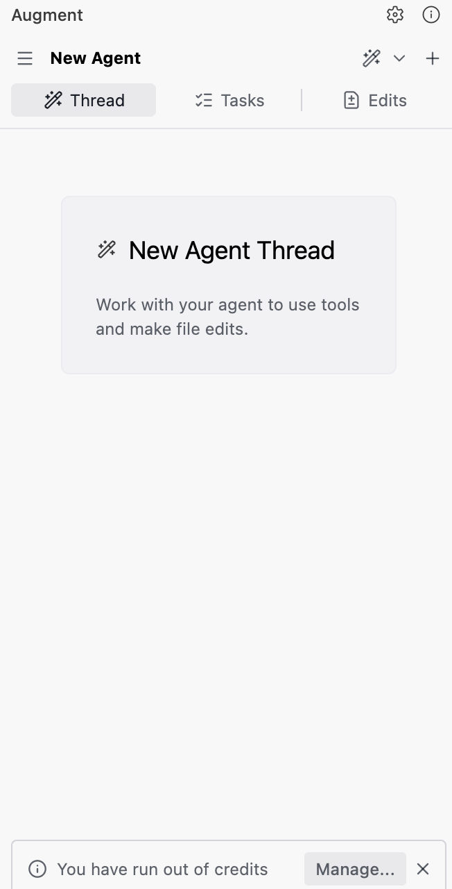
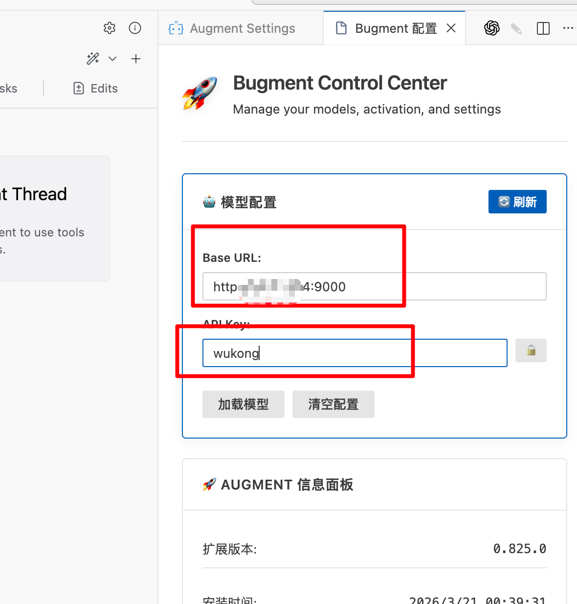
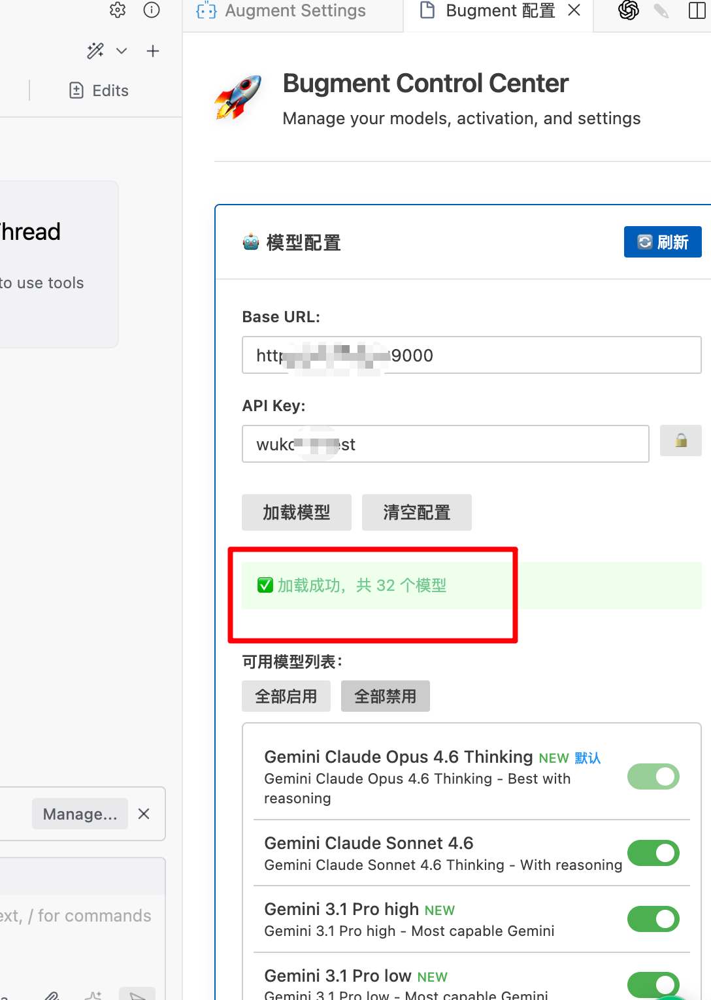

# 🐵 Wukong Augment — 悟空增强版 Augment 插件

> 让 Augment 连接自定义 API 服务，支持 32+ 主流大模型，0 积分即可使用。
>
> **结论：反重力 / GPT5.4 + Bugment = 满血 Augment**

## 📦 插件文件

| 文件 | 适用 IDE | 大小 |
|------|----------|------|
| `vscode-Bugment-悟空-0.825.0.vsix` | VS Code / Cursor | ~24 MB |
| `bugment-idea-1.0.2.zip` | JetBrains 系列（IntelliJ IDEA / GoLand / PyCharm / WebStorm 等） | ~5.4 MB |

---

## ✨ 增强特性

相比原生 Augment，Bugment 插件在以下三个方面做了显著增强：

### 🖼️ 图片理解增强

原生 Augment 对图片的处理能力有限。Bugment 对图片处理进行了**专门的编程场景优化**，当你发送截图时，会自动生成结构化的 **📷 Image Context**，包含：

- **场景描述（Scene）**：自动识别截图中的界面状态、组件结构
- **可见文本提取（Visible Text）**：精确提取界面中的所有文字内容
- **UI 结构分析（UI/Structure Details）**：分析图标对齐、元素层级、缩进关系等布局细节
- **问题证据推理（Evidence Relevant to User Question）**：结合用户提问，自动定位截图中与问题相关的关键线索

> 💡 **典型使用场景**：发送 UI 截图 → Bugment 自动分析布局问题（如图标未对齐、偏移量不一致） → 直接定位到需要修改的代码文件和行号。特别适合前端 CSS 调试、布局修复、UI 还原等编程任务。

### 🧠 提示词增强

Bugment 对对话中的提示词进行了深度优化，使 AI 在编程场景下的理解和执行更加精准。

> 📄 详细的增强提示词说明见 [FEATURES.md](FEATURES.md)

### 🛠️ Skills 技能调用

内置 7 个专业技能，AI 会根据对话内容自动匹配并加载对应技能：

| 技能 | 说明 |
|------|------|
| **claude-api** | Claude API / Anthropic SDK 开发参考 |
| **docx** | Word 文档创建、编辑、格式处理 |
| **frontend-design** | 高质量前端界面设计与实现 |
| **pptx** | PPT 演示文稿创建与编辑 |
| **screenshot** | 系统级屏幕截图 |
| **template-skill** | 技能模板（可基于此创建自定义技能） |
| **xlsx** | Excel 电子表格处理（公式、图表、数据清洗） |

> 📄 Skills 的安装与配置说明见 [FEATURES.md](FEATURES.md)

---

## 🚀 安装与配置教程

### 第一步：安装插件

#### VS Code / Cursor

1. 下载本仓库中的 `vscode-Bugment-悟空-0.825.0.vsix` 文件
2. 打开 VS Code，按 `Ctrl+Shift+P`（macOS: `Cmd+Shift+P`）打开命令面板
3. 输入 `Extensions: Install from VSIX...`
4. 选择下载的 `.vsix` 文件，点击安装
5. 安装完成后**重启 VS Code**

#### JetBrains 系列（IDEA / GoLand / PyCharm / WebStorm 等）

1. 下载本仓库中的 `bugment-idea-1.0.2.zip` 文件
2. 打开 IDE → `Settings`（macOS: `Preferences`）→ `Plugins`
3. 点击右上角 ⚙️ 齿轮图标 → `Install Plugin from Disk...`
4. 选择下载的 `.zip` 文件，点击确定
5. 安装完成后**重启 IDE**

---

### 第二步：登录 Augment 账号

1. 安装插件后，侧边栏会出现 **Augment** 图标
2. 点击打开，按提示**登录或注册 Augment 账号**
3. **0 积分就行**，不需要付费，只要有账号即可

> 💡 登录成功后你会看到 "New Agent Thread" 界面，底部可能提示 "You have run out of credits" —— 这是正常的，不影响使用。

---

### 第三步：配置远端 API 服务

1. 在 Augment 面板中，点击顶部的 **Bugment 配置** 标签页（或通过命令面板搜索 `Bugment`）
2. 在 **🐱 模型配置** 区域，填写以下信息：

| 配置项 | 说明 |
|--------|------|
| **Base URL** | 填写 API 服务地址（如 `http://你的服务器IP:9000`） |
| **API Key** | 填写分配给你的 API Key |

> ⚠️ **Base URL 和 API Key 由管理员提供**，请联系管理员获取。

---

### 第四步：加载模型并开始使用

1. 填写完 Base URL 和 API Key 后，点击 **「加载模型」** 按钮
2. 加载成功后会显示绿色提示：**✅ 加载成功，共 N 个模型**
3. 在 **可用模型列表** 中，开启/关闭你想使用的模型
4. **⚠️ 记得点击保存**
5. 返回 Augment 对话界面，选择模型即可开始对话！

**支持的模型示例：**
- Gemini Claude Opus 4.6 Thinking
- Gemini Claude Sonnet 4.6
- Gemini 3.1 Pro high / low
- 以及更多 30+ 模型...

---

## 🔧 常见问题

### Q: 登录提示积分为 0，还能用吗？
**A:** 可以。只要登录成功，配置好远端 API 即可使用，不消耗 Augment 官方积分。

### Q: 加载模型失败怎么办？
**A:** 请检查：
1. Base URL 是否正确（注意 `http://` 前缀和端口号）
2. API Key 是否正确
3. 网络是否能访问到 API 服务器
4. 点击 **「刷新」** 按钮重试

### Q: 支持哪些 IDE？
**A:** 
- **VS Code** / **Cursor**：使用 `.vsix` 插件
- **JetBrains 全系列**（IntelliJ IDEA、GoLand、PyCharm、WebStorm、CLion、Rider 等）：使用 `.zip` 插件

### Q: 如何更新插件？
**A:** 下载最新版本的插件文件，按照第一步重新安装即可。新版本会自动覆盖旧版本。

---

## 📋 版本信息

| 组件 | 版本 |
|------|------|
| VS Code 插件 | 0.825.0 |
| JetBrains 插件 | 1.0.2 |

---

## ⚠️ 声明

本仓库仅做**搬运与分享**，插件的原始作者另有其人，本人**不是插件作者**。如有侵权请联系删除。

## 📄 License

本项目仅供学习交流使用，请勿用于商业用途。
